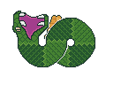

### taileater

taileater is a puzzle game available for free here: https://szunami.itch.io/taileater

This project is built using [Rust](https://www.rust-lang.org/) and [Bevy](https://bevyengine.org/). Assets were built with [aseprite](https://www.aseprite.org/).

I do not anticipate doing much further development work on this project. I am open sourcing it in the off chance that is helpful to someone else someday!
